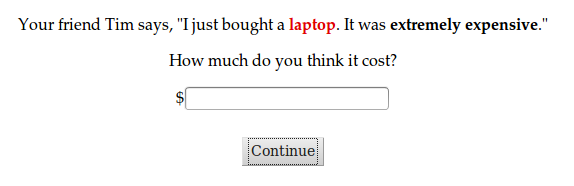

# Intensity of degree adverbs

Hypothesis: adverbs of degree, like "somewhat" and "extremely", modify the adjectives they describe in proportion to the cost of uttering them. For example, if "inordinately" is more costly to utter than "very", the former will have a stronger meaning than the latter.

This cost might manifest in syllable length or in surprisal (how unlikely is that word to be said?).

## Intro
Degree adverbs are adverbs that modify scalar adjectives by increasing or decreasing the extent to which that adjective applies. For example, "very" and "extremely" are degree adverbs that intensify the adjectives they modify, and "moderately" and "sorta" are degree adverbs that deintensify the adjectives they modify.

How do we know how much a degree adverb will modify an adjective's meaning? In this paper, we hypothesize that communicative pressures might determine the meanings of these degree adverbs: those that are easier to retrieve from memory and to say will have correspondingly weaker meanings, and those that are more costly to utter will have stronger meanings. This hypothesis predicts that longer degree adverbs will have stronger meanings, but also that the more commonly used a particular degree adverb is (and therefore the more accessible it is) the weaker its meaning will become.

Molly, Elise, and Mike found that longer words tend to have more complex meanings associated with them, and learners tend to use this information in interpreting novel words. They hypothesized that lexicalized in-the-moment communicative pressures might be responsible for this complexity bias.

## Experiment 1: intensifiers

```{r echo=F}
intensifiers = read.table("intensifiers.tsv", header=T, sep="\t")
intensifiers = subset(intensifiers, workerid < 40) #later workers are for later experiments
intensifiers$workerid = as.factor(intensifiers$workerid)
intensifiers = intensifiers[,c("price", "intensifier", "item", "workerid")]
library(plyr)
intensifiers = ddply(intensifiers, .(workerid), transform, zprice=scale(price))
intensifiers = ddply(intensifiers, .(workerid, item), transform, zzprice=scale(price))

intensifiers = intensifiers[!is.na(intensifiers$zzprice),]
intensifiers = intensifiers[intensifiers$intensifier != "",] #don't include no intensifier in the analysis, but do use it to zscore.
## ngrams
ngrams = read.table("ngrams.sep", header=T, sep="\t")
frequency = ngrams$frequency
names(frequency) = ngrams$ngram
syllables = ngrams$syllables
names(syllables) = ngrams$ngram
total_1grams = 1024908267229
intensifiers$frequency = sapply(as.character(intensifiers$intensifier), function(adverb) {
  frequency[[adverb]]
})
intensifiers$probability = intensifiers$frequency / total_1grams
intensifiers$surprisal = - log(intensifiers$probability)
intensifiers$syllables = sapply(as.character(intensifiers$intensifier), function(adverb) {
  if (adverb == "") {
    return(0)
  } else {
    return(syllables[[adverb]])
  }
})
```

In Experiment 1, we tested whether intensifying degree adverbs have stronger meanings (higher prices when paired with ``expensive'') when they have higher communicative cost.

### Method

#### Participants
I ran this experiment on 40 participants.

#### Materials

We consider surprisal and length in syllables as possible sources of communicative cost. We calculate the surprisal of a word (-log(P(word))) by approximating the probability of a word as the proportion of occurances in the Google Web 1T 5-grams database.

Here are the intensifiers, surprisals, and syllable lengths in this experiment:

```{r echo=F}
print(ngrams)
```

For the set of degree adverbs I studied, the correlation between my two possible measure of cost, surprisal and syllable length, is `r with(intensifiers, cor(surprisal, syllables))`.

I asked participants the prices of different "*[adverb]* expensive" watches, laptops, and coffee makers. Prices were elicited with free response, and trials looked like this:



### Results

In a simple ANOVA, participant (`workerid`) predicted responses better than item and intensifier.

```{r echo=F}
fit = lm(price ~ intensifier * item * workerid, data=intensifiers)
print(anova(fit))
```

This probably has something to do with the fact that some participants gave answers that were insanely high.

```{r fig.width=10, fig.height=4.5, echo=F}
library(ggplot2)
source("~/opt/r_helper_scripts/bootsSummary.r")
# intensifiers_summary = bootsSummary(data=intensifiers, measurevar="price", groupvars=c("item", "intensifier", "syllables", "surprisal"))
# p = ggplot(intensifiers_summary, aes(x=surprisal, y=price, colour=syllables)) +
#   geom_point() +
#   geom_smooth(method="lm", se=T, colour="black") +
#   geom_errorbar(aes(ymin=bootsci_low, ymax=bootsci_high, x=surprisal)) +
#   facet_wrap(~ item) +
#   #scale_colour_grey() +
#   scale_colour_gradient(low="black", high="gray", space="Lab") +
#   theme_bw(28)
# # print(p)
# ggsave("exp1-raw.png", width=10, height=4.5)

intensifiers_summary = bootsSummary(data=intensifiers, measurevar="price", groupvars=c("item", "intensifier", "syllables", "surprisal"))
p = ggplot(intensifiers_summary, aes(x=syllables, y=price, colour=surprisal)) +
  geom_point() +
  geom_smooth(method="lm", se=T, colour="black") +
  geom_errorbar(aes(ymin=bootsci_low, ymax=bootsci_high, x=syllables)) +
  facet_wrap(~ item) +
  #scale_colour_grey() +
  scale_colour_gradient(low="black", high="gray", space="Lab") +
  theme_bw(28)
print(p)
ggsave("exp1-raw-syllables.png", width=10, height=4.5)

p = ggplot(intensifiers, aes(x=surprisal, y=zzprice)) +
  geom_point() +
  geom_smooth(method="lm", se=T, colour="black") +
  facet_wrap(~ workerid) +
  #scale_colour_grey() +
  #scale_colour_gradient(low="black", high="gray", space="Lab") +
  theme_bw(28)
print(p)
ggsave("exp1-raw-syllables.png", width=10, height=4.5)
```

I ran a mixed effect model with syllables and surprisal as fixed effects and workerid and item as random effects, which found no significant effect of either fixed effect on response.

```{r echo=F}
library(lme4)
library(lmerTest)
fit = lmer(data=intensifiers, price~(surprisal + syllables) + (1 | item) + (1 | workerid) + (surprisal + syllables | workerid) + (surprisal + syllables | item))
print(summary(fit))
fit = lmer(data=intensifiers, price~surprisal + (1 + surprisal | item) + (1 + surprisal | workerid))
print(summary(fit))
zfit = lmer(data=intensifiers, zprice~surprisal + (1 + surprisal | item) + (1 + surprisal | workerid))
print(summary(zfit))
zzfit = lmer(data=intensifiers, zzprice~surprisal + (1 + surprisal | item) + (1 + surprisal | workerid))
print(summary(zzfit))
zzfit = lmer(data=intensifiers, zzprice~(surprisal + syllables) + (1 + (surprisal + syllables) | item) + (1 + (surprisal + syllables) | workerid))
print(summary(zzfit))
```

However, every participant saw every combination of intensifier and item, so I can z-score by `workerid` and `item` which standardizes participants beliefs about different items' prices and the ranges of those prices.

When I do this, I find significant effects of surprisal and syllable length.

```{r fig.width=10, fig.height=4.5, echo=F}
fit = lm(zzprice ~ surprisal * syllables, data=intensifiers)
print(summary(fit))

zz_intensifiers_summary = bootsSummary(data=intensifiers[as.character(as.numeric(intensifiers$workerid))<20,], measurevar="zzprice", groupvars=c("item", "intensifier", "syllables", "surprisal"))
p = ggplot(zz_intensifiers_summary, aes(x=surprisal, y=zzprice, colour=syllables)) +
  geom_point() +
  geom_smooth(method="lm", se=T, colour="black") +
  geom_errorbar(aes(ymin=bootsci_low, ymax=bootsci_high, x=surprisal)) +
  facet_wrap(~ item) +
  #scale_colour_grey() +
  scale_colour_gradient(low="black", high="gray") +
  theme_bw(28)
print(p)
ggsave("exp1-zz.png", width=10, height=4.5)
```

I also find a significant negative interaction between syllables and suprisal.

### Conclusion

So it seems like there is some relationship between the cost of an intensifier and its strength.

I was concerned that the relationship between surprisal and strength might be an effect of more extreme objects being less common and therefore talked about less, which would result in words that describe those objects being rarer. So I ran Experiment 2 to test that hypothesis.

## Experiment 2: deintensifiers

```{r echo=F}
deintensifiers = read.table("intensifiers.tsv", header=T, sep="\t")
deintensifiers = subset(deintensifiers, workerid >= 40) #later workers are for later experiments
deintensifiers$workerid = as.factor(deintensifiers$workerid)
deintensifiers = deintensifiers[,c("price", "intensifier", "item", "workerid")]
deintensifiers = ddply(deintensifiers, .(workerid), transform, zprice=scale(price))
deintensifiers = ddply(deintensifiers, .(workerid, item), transform, zzprice=scale(price))
deintensifiers = deintensifiers[!is.na(deintensifiers$zzprice),]
deintensifiers = deintensifiers[deintensifiers$intensifier != "",]

## ngrams
ngrams = read.table("ngrams.sep", header=T, sep="\t")
frequency = ngrams$frequency
names(frequency) = ngrams$ngram
syllables = ngrams$syllables
names(syllables) = ngrams$ngram
deintensifiers$frequency = sapply(as.character(deintensifiers$intensifier), function(adverb) {
  frequency[[adverb]]
})
deintensifiers$syllables = sapply(as.character(deintensifiers$intensifier), function(adverb) {
  syllables[[adverb]]
})

#this isn't quite surprisal, but it's proportional to surprisal
deintensifiers$surprisal = -log(deintensifiers$frequency)
```

Experiment 2 tests a competing hypothesis that might explain some of the data in Experiment 1.

Supposed that objects that are more extreme along a scale are less common and therefore talked about less. Then words that describe them (adverbs of degree that are quite strong) would be more rare. Thus the surprisal at these words would be a consequenct of their meaning rather than a cause. Were this the case, then stronger *deintensifying* adverbs of degree (e.g. "somewhat" or "moderately") would be more common because they describe more typical items that are more moderate along a scale.

### Method

#### Materials

7 deintensifiers.

#### Participants

40 Turkers.

### Results

I found no evidence for the competing hypothesis (that stronger deintensifying adverbs of degree are more common). I also did not find evidence that stronger deintensifying degree adverbs are rarer or longer: in fact, I found a slight positive correlation between syllable length and response, implying that longer deintensifying adverbs are *less* strong. Though since I only have one example of a deintensifying adverb of any syllable length other than 2, this finding should be taken with a grain of salt.

```{r fig.width=10, fig.height=4.5, echo=F}
zzfit = lm(data=deintensifiers, zzprice~surprisal * syllables)
print(summary(zzfit))

deintensifiers_summary = bootsSummary(data=deintensifiers, measurevar="zzprice", groupvars=c("item", "intensifier", "syllables", "surprisal"))
p = ggplot(deintensifiers_summary, aes(x=surprisal, y=zzprice, colour=syllables)) +
  geom_point() +
  geom_smooth(method="lm", se=T,colour="black") +
  geom_errorbar(aes(ymin=bootsci_low, ymax=bootsci_high, x=surprisal)) +
  facet_wrap(~ item) +
  #scale_colour_grey() +
  scale_colour_gradient(low="black", high="gray") +
  theme_bw(22)
print(p)
ggsave("exp2-zz.png", width=10, height=4.5)

deintensifiers_summary = bootsSummary(data=deintensifiers, measurevar="zzprice", groupvars=c("item", "intensifier", "syllables", "surprisal"))
p = ggplot(deintensifiers_summary, aes(x=syllables, y=zzprice, colour=surprisal)) +
  geom_point() +
  geom_smooth(method="lm", se=T,colour="black") +
  geom_errorbar(aes(ymin=bootsci_low, ymax=bootsci_high, x=syllables)) +
  facet_wrap(~ item) +
  #scale_colour_grey() +
  scale_colour_gradient(low="black", high="gray") +
  theme_bw(22)
print(p)
ggsave("exp2-zz-syllables.png", width=10, height=4.5)
```

### Conclusion
This absence of a significant result for surprisal might be a result of floor effects or a more subtle meaning than I assumed for deintensifiers. Either way, the significance of syllable length in Experiment 1 cannot be explained with this competing hypothesis.

## Experiment 3:

```{r echo=F}
degree_adverbs = read.table("degree-adverbs.tsv", header=T, sep="\t")
degree_adverbs$workerid = as.factor(degree_adverbs$workerid)
degree_adverbs = degree_adverbs[,c("price", "word", "item", "workerid")]
degree_adverbs$intensifier = degree_adverbs$word
degree_adverbs = ddply(degree_adverbs, .(workerid), transform, zprice=scale(price))
degree_adverbs = ddply(degree_adverbs, .(workerid, item), transform, zzprice=scale(price))
degree_adverbs = degree_adverbs[degree_adverbs$word != "",]
degree_adverbs = degree_adverbs[!is.na(degree_adverbs$zzprice),]

degree_adverbs$direction = rep("none", nrow(degree_adverbs))
degree_adverbs$direction[degree_adverbs$word %in% c("horribly","super", "uber", "totally", "radically",
                                                         "decidedly", "ridiculously", "pretty", "phenomenally",
                                                         "crazily", "terribly", "stupidly", "vastly", "intensely",
                                                         "greatly", "highly", "extraordinarily", "really",
                                                         "outrageously", "excessively", "astoundingly", "very",
                                                         "extremely", "supremely", "real", "wildly",
                                                         "fantastically", "truly", "amazingly", "enormously",
                                                         "crazy", "rather", "uncommonly", "exceedingly", "insanely",
                                                         "quite", "hugely", "ever so")] = "intensifier"
degree_adverbs$direction[degree_adverbs$word %in% c("relatively", "somewhat", "moderately", "barely",
                                                           "fairly", "sorta", "slightly", "kinda", "reasonably",
                                                           "a tad", "sort of", "a bit", "kind of", "a little")] = "deintensifier"

degree_adverbs = degree_adverbs[degree_adverbs$intensifier != "",]

## ngrams
ngrams = read.table("ngrams2.sep", header=T, sep="\t")
frequency = ngrams$frequency
names(frequency) = ngrams$ngram
syllables = ngrams$syllables
names(syllables) = ngrams$ngram
degree_adverbs$frequency = sapply(as.character(degree_adverbs$intensifier), function(adverb) {
  frequency[[adverb]]
})
degree_adverbs$syllables = sapply(as.character(degree_adverbs$intensifier), function(adverb) {
  syllables[[adverb]]
})
degree_adverbs$surprisal = -log(degree_adverbs$frequency) #this isn't quite surprisal, but it's proportional to surprisal

intensifiers = degree_adverbs[degree_adverbs$direction == "intensifier",]
deintensifiers = degree_adverbs[degree_adverbs$direction == "deintensifier",]
```

In Experiment 3, I tried to replicate my findings from Experiment 1 (that stronger intensifying degree adverbs happen to have higher costs) and from Experiment 2 (that stronger deintensifying adverbs are not necessarily more common). This time I tested all participants on all combinations of item and adverb, where adverbs were either intensifying or deintensifying degree adverbs. I only ran this experiment on 10 participants.

### Method

#### Participants

This was only run on 10 participants.

#### Method

Slightly different set of intensifiers and deintensifiers.

### Results

I found a significant effect of suprisal, but no significant effect of syllable length above and beyond surprisal.

```{r fig.width=10, fig.height=4.5, echo=F}
intensifiers_summary = bootsSummary(data=intensifiers, measurevar="zzprice", groupvars=c("item", "intensifier", "syllables", "surprisal"))
p = ggplot(intensifiers_summary, aes(x=surprisal, y=zzprice, colour=syllables)) +
  geom_point() +
  geom_smooth(method="lm", se=T, colour="black") +
  geom_errorbar(aes(ymin=bootsci_low, ymax=bootsci_high, x=surprisal)) +
  scale_colour_gradient(low="black", high="gray") +
  facet_wrap(~ item) +
  theme_bw(28)
print(p)
ggsave("exp3-intensifiers-zz.png", width=10, height=4.5)
p = ggplot(intensifiers_summary, aes(x=syllables, y=zzprice, colour=surprisal)) +
  geom_point() +
  geom_smooth(method="lm", se=T, colour="black") +
  geom_errorbar(aes(ymin=bootsci_low, ymax=bootsci_high, x=syllables)) +
  scale_colour_gradient(low="black", high="gray") +
  facet_wrap(~ item) +
  theme_bw(28)
print(p)
ggsave("exp3-intensifiers-zz-syllables.png", width=10, height=4.5)

zzfit = lm(data=intensifiers, zzprice~surprisal * syllables)
print(summary(zzfit))
```

Among the deintensifiers, I found a significant negative effect of surprisal and positive effect of syllables as well as a significant positive interaction between the two.

```{r fig.width=10, fig.height=4.5, echo=F}
deintensifiers_summary = bootsSummary(data=deintensifiers, measurevar="zzprice", groupvars=c("item", "intensifier", "syllables", "surprisal"))
p = ggplot(deintensifiers_summary, aes(x=syllables, y=zzprice, colour=surprisal)) +
  geom_point() +
  geom_smooth(method="lm", se=T, colour="black") +
  geom_errorbar(aes(ymin=bootsci_low, ymax=bootsci_high, x=syllables)) +
  scale_colour_gradient(low="black", high="gray") +
  facet_wrap(~ item) +
  theme_bw(28)
  facet_wrap(~ item)
print(p)
ggsave("exp3-deintensifiers-zz-syllables.png", width=10, height=4.5)
p = ggplot(deintensifiers_summary, aes(x=surprisal, y=zzprice, colour=syllables)) +
  geom_point() +
  geom_smooth(method="lm", se=T, colour="black") +
  geom_errorbar(aes(ymin=bootsci_low, ymax=bootsci_high, x=surprisal)) +
  scale_colour_gradient(low="black", high="gray") +
  facet_wrap(~ item) +
  theme_bw(28)
  facet_wrap(~ item)
print(p)
ggsave("exp3-deintensifiers-zz.png", width=10, height=4.5)

zzfit = lm(data=deintensifiers, zzprice~surprisal * syllables)
print(summary(zzfit))
```