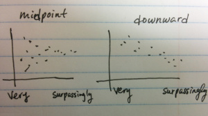

# Degree Adverbs: Experiment 3

## Conclusion

I had a flaw in my logic. I thought this would somehow deconfound the frequency => meaning versus meaning => frequencies ideas, but it doesn't.

I came up with Experiment 2 because strong deintensifying degree adverbs describe things that are *more common* (under the assumption that things that are a slight deviation from the mean are more common to see than things that are far from the mean) and so if stronger deintensifying degree adverbs were less frequent, then this would not be due to the thing they describe being infrequent. This would therefore provide evidence that the frequency causes the meaning rather than the other way around.

But in Experiment 3, we're using the same words as in Experiment 1. The stronger of these words are still usually used to describe uncommon things, even though we're using them to describe more common things here. So their frequency *in the corpus* might still be a function of their meaning.

At best, the "extreme" condition of Experiment 3 could replicate the findings of Experiment 1. The "average" condition gives us more data points of what people think an average laptop, sweater, etc. costs.

We *kind of* replicate the finding from Experiment 1 in the "extreme" condition of Experiment 3.

## Hypothesis:

If intensifying degree adverbs derive their strength from their cost, and if cost depends on frequency (low frequency => higher cost), then as frequency of a word decreases, its strength should increase. In the case where the modified adjective is high on a scale, this will result in higher values. In the case where the modified adjective points to the middle of the scale, prices should go down (or possibly towards a midpoint -- I maybe should have thought that through more).



## adverbs

A new set of degree adverbs was chosen for minimal lexical ambiguity and homographs, i.e. such that the main sense of the word is the degree modification one.

```{r, fig.width=10, fig.height=4.5}
library(ggplot2)
total_1grams = 1024908267229
degree_adverbs = read.table("degree-adverbs-exp3.csv", header=T, sep=",")
print(degree_adverbs)
degree_adverbs$log_prob = log(degree_adverbs$count) / log(total_1grams)
degree_adverbs$sort_order = as.numeric(as.factor(degree_adverbs$log_prob))
degree_adverbs$adverb = with(degree_adverbs, factor(adverb, levels=adverb[sort_order]))
p = ggplot(degree_adverbs, aes(x=sort_order, y=log_prob, colour=adverb)) +
  geom_point() +
  geom_text(aes(label=adverb), angle=(180+135), hjust=-0.1, size=3) +
  xlab("") +
  ylab("log probability of adverb") +
  ylim(0.2, 0.71) +
  theme_bw()  +
  theme(legend.position="none")
print(p)

data1 = read.table("exp3.tsv", header=T, sep="\t")
data2 = read.table("exp3-moremoney.tsv", header=T, sep="\t")
data2$workerid = data2$workerid + nrow(data1)
data = rbind(data1, data2)[,c("workerid", "adverb", "object", "response", "condition")]
data = subset(data, workerid != 430)
data = subset(data, condition == "extreme")
data$log_prob = sapply(as.character(data$adverb), function(adverb) {return(degree_adverbs$log_prob[as.character(degree_adverbs$adverb) == adverb])})
data$syllables = sapply(as.character(data$adverb), function(adverb) {return(degree_adverbs$syllables[as.character(degree_adverbs$adverb) == adverb])})
p = ggplot(data, aes(x=log_prob, y=response, colour=object)) +
  geom_point() +
  geom_smooth(method="lm", se=T)
print(p)

fit = lm(response ~ object * log_prob * syllables, data=data)
print(fit)
print(anova(fit))
source("~/opt/r_helper_scripts/bootsSummary.r")
data_summary = bootsSummary(data=data, measurevar="response", groupvars=c("object", "adverb", "syllables", "log_prob"))
for (object in c("laptop", "sweater", "headphones", "coffee maker")) {
  subdata = data_summary[data_summary$object == object,]
  print(cor(subdata$response, subdata$log_prob))
}
```

