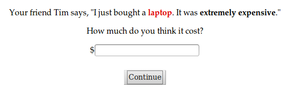

```{r echo=F}
### load required packages

library(lme4, quietly=T)
library(lmerTest, quietly=T)
library(ggplot2, quietly=T)
library(plyr, quietly=T)
source("~/opt/r_helper_scripts/bootsSummary.r")
source("~/opt/r_helper_scripts/gg_themes.R")
```

```{r echo=F}
### load data

intensifiers = read.table("intensifiers.tsv", header=T, sep="\t")

# the first 40 participants saw intensifiers (September 5 2013),
# and the last 40 participants saw deintensifiers (January 12 2014)
intensifiers = subset(intensifiers, workerid < 40)

intensifiers$workerid = as.factor(intensifiers$workerid)
intensifiers = intensifiers[,c("price", "intensifier", "item", "workerid")]
intensifiers$logprice = log(intensifiers$price)
intensifiers = ddply(intensifiers, .(workerid), transform, zlogprice=scale(logprice))

# for clean data visualization, but not for analysis
intensifiers = ddply(intensifiers, .(workerid, item), transform, zzlogprice=scale(logprice))

# one participant gave all laptops the same price, regardless of intensifier
intensifiers = intensifiers[!is.na(intensifiers$zzlogprice),]

# i also asked everyone to give the prices for "an expensive (laptop|watch|coffee maker)"
# which i use to zscore, because everyone saw it, but then i get rid of it.
intensifiers = intensifiers[intensifiers$intensifier != "",]

## ngrams
ngrams = read.table("ngrams.sep", header=T, sep="\t")
frequency = ngrams$frequency
names(frequency) = ngrams$ngram
syllables = ngrams$syllables
names(syllables) = ngrams$ngram
total_1grams = 1024908267229
intensifiers$frequency = sapply(as.character(intensifiers$intensifier), function(adverb) {
  frequency[[adverb]]
})
intensifiers$probability = intensifiers$frequency / total_1grams
intensifiers$surprisal = - log(intensifiers$probability)
intensifiers$syllables = sapply(as.character(intensifiers$intensifier), function(adverb) {
  if (adverb == "") {
    return(0)
  } else {
    return(syllables[[adverb]])
  }
})
```

Do degree adverbs with higher costs have stronger meanings?

## Experiment 1A: Intensifiers

We used `r length(unique(intensifiers$intensifier))` intensifying degree adverbs.

```{r echo=F}
print(ngrams[ngrams$ngram %in% as.character(intensifiers$intensifier),])
```

Questions looked like this:



The raw data sucks, so I z-scored by subject and item in the graphs, and stats are done with a mixed effects model.

```{r echo=F, fig.width=10, fig.height=6}
intensifiers_summary = bootsSummary(data=intensifiers[intensifiers$workerid != "39",], measurevar="price", groupvars=c("intensifier", "surprisal", "syllables"))
p = ggplot(intensifiers_summary, aes(x=surprisal, y=price, color=syllables)) +
  geom_point() +
  geom_errorbar(aes(ymin=bootsci_low, ymax=bootsci_high, x=surprisal, width=0)) +
  geom_text(aes(label=intensifier)) +
  theme_black() +
  scale_colour_gradientn(colours=rev(gg_color_hue(7)[1:6])) +
  geom_smooth(method="lm", se=T, colour="white")
print(p)
```

We found a relationship between both surprisal and syllable length. As these values increase, so does the price participants give (graph is zscored by workerid and item for clarity).

```{r echo=F, fig.width=10, fig.height=6}
p = ggplot(intensifiers, aes(x=surprisal, y=zzlogprice, color=syllables)) +
  geom_point(alpha=1/3) +
  geom_smooth(method="lm", se=T, colour="black")
print(p)
```

Here's a mixed effects model that shows that.

```{r echo=F}
fit = lmer(logprice ~ 1 + surprisal + syllables +
             (1 + surprisal + syllables | workerid/item), data=intensifiers)
print(summary(fit))
```

## Experiment 1B: Deintensifiers

```{r echo=F}
### load data

deintensifiers = read.table("intensifiers.tsv", header=T, sep="\t")

# the first 40 participants saw intensifiers (September 5 2013),
# and the last 40 participants saw deintensifiers (January 12 2014)
deintensifiers = subset(deintensifiers, workerid >= 40)

deintensifiers$workerid = as.factor(deintensifiers$workerid)
deintensifiers = deintensifiers[,c("price", "intensifier", "item", "workerid")]
deintensifiers$logprice = log(deintensifiers$price)
deintensifiers = ddply(deintensifiers, .(workerid), transform, zlogprice=scale(logprice))

# for clean data visualization, but not for analysis
deintensifiers = ddply(deintensifiers, .(workerid, item), transform, zzlogprice=scale(logprice))

# one participant gave all laptops the same price, regardless of intensifier
deintensifiers = deintensifiers[!is.na(deintensifiers$zzlogprice),]

# i also asked everyone to give the prices for "an expensive (laptop|watch|coffee maker)"
# which i use to zscore, because everyone saw it, but then i get rid of it.
deintensifiers = deintensifiers[deintensifiers$intensifier != "",]

## ngrams
ngrams = read.table("ngrams.sep", header=T, sep="\t")
frequency = ngrams$frequency
names(frequency) = ngrams$ngram
syllables = ngrams$syllables
names(syllables) = ngrams$ngram
deintensifiers$frequency = sapply(as.character(deintensifiers$intensifier), function(adverb) {
  frequency[[adverb]]
})
deintensifiers$surprisal = - log(deintensifiers$frequency)
deintensifiers$syllables = sapply(as.character(deintensifiers$intensifier), function(adverb) {
  if (adverb == "") {
    return(0)
  } else {
    return(syllables[[adverb]])
  }
})
```

We used `r length(unique(deintensifiers$intensifier))` intensifying degree adverbs.

```{r echo=F}
print(ngrams[ngrams$ngram %in% as.character(deintensifiers$intensifier),])
```

My set of deintensifiers doesn't have as much variation as my set of intensifiers does in terms of either suprisal or syllable length.

```{r echo=F, fig.width=4, fig.height=4}
ngrams$type = "intensifier"
ngrams$type[ngrams$ngram %in% as.character(deintensifiers$intensifier)] = "deintensifier"
p = ggplot(ngrams, aes(color=type, x=type, y=-log(frequency))) +
  geom_point(size=2) +
  theme_blackDisplay() + 
  ggtitle("surprisal")
print(p)
p = ggplot(ngrams, aes(color=type, x=type, y=syllables)) +
  geom_point(size=5, alpha=1/6) +
  theme_blackDisplay() + 
  ggtitle("syllables")
print(p)
```

I find no relationship between participants' responses and either surprisal or syllable length.

```{r echo=F, fig.width=10, fig.height=6}
deintensifiers_summary=bootsSummary(data=deintensifiers, measurevar="logprice",groupvars=c("intensifier"))
deintensifiers_summary$syllables = ordered(deintensifiers_summary$syllables)
p = ggplot(deintensifiers_summary, aes(x=surprisal, y=logprice, color=syllables)) +
  geom_point() +
  theme_blackDisplay() +
  geom_text(aes(label=intensifier)) +
  scale_colour_manual(values=rev(gg_color_hue(7)[c(2,4)])) +
  geom_errorbar(aes(ymin=bootsci_low, ymax=bootsci_high, x=surprisal, width=0)) +
  geom_smooth(method="lm", se=T, colour="white")
print(p)
ggsave("deintensifiers-surprisal-raw.png", width=10, height=6)

deintensifiers_summary=bootsSummary(data=deintensifiers, measurevar="logprice",groupvars=c("surprisal", "syllables", "intensifier", "item"))
deintensifiers_summary$syllables = ordered(deintensifiers_summary$syllables)
p = ggplot(deintensifiers_summary, aes(x=surprisal, y=logprice, color=syllables)) +
  geom_point() +
  facet_wrap(~ item) +
  theme_blackDisplay() +
  geom_text(aes(label=intensifier)) +
  scale_colour_manual(values=rev(gg_color_hue(7)[c(2,4)])) +
  geom_errorbar(aes(ymin=bootsci_low, ymax=bootsci_high, x=surprisal, width=0)) +
  geom_smooth(method="lm", se=T, colour="white")
print(p)
ggsave("deintensifiers-surprisal-raw-facet.png", width=10, height=6)

deintensifiers_summary=bootsSummary(data=deintensifiers, measurevar="zzlogprice",groupvars=c("surprisal", "syllables", "intensifier"))
deintensifiers_summary$syllables = ordered(deintensifiers_summary$syllables)
p = ggplot(deintensifiers_summary, aes(x=surprisal, y=zzlogprice, color=syllables)) +
  geom_point() +
  theme_blackDisplay() +
  geom_text(aes(label=intensifier)) +
  scale_colour_manual(values=rev(gg_color_hue(7)[c(2,4)])) +
  geom_errorbar(aes(ymin=bootsci_low, ymax=bootsci_high, x=surprisal, width=0)) +
  geom_smooth(method="lm", se=T, colour="white")
print(p)
ggsave("deintensifiers-surprisal.png", width=10, height=6)

fit = lmer(logprice ~ 1 + surprisal + syllables +
             (1 + surprisal + syllables | workerid/item), data=deintensifiers)
print(summary(fit))
```

I also dont see any relationship between these variables when I only look at the subset of intensifiers within the same frequency range as the deintensifiers.

```{r echo=F, fig.width=10, fig.height=6}
minfreq = min(deintensifiers$frequency)
maxfreq = max(deintensifiers$frequency)
intensifiers_subrange = intensifiers[intensifiers$frequency > minfreq &
                                  intensifiers$frequency < maxfreq,]
intensifiers_summary = bootsSummary(data=intensifiers[intensifiers$workerid != "39",], measurevar="logprice", groupvars=c("intensifier", "frequency", "syllables"))
intensifiers_subrange_summary = bootsSummary(data=intensifiers_subrange[intensifiers_subrange$workerid != "39",], measurevar="logprice", groupvars=c("intensifier", "frequency", "syllables"))
intensifiers_summary$syllables = ordered(intensifiers_summary$syllables)
p = ggplot(intensifiers_summary, aes(x=-log(frequency), y=logprice, color=syllables)) +
  geom_point() +
  theme_blackDisplay() +
  scale_colour_manual(values=rev(gg_color_hue(7)[c(1,2,3,4)])) +
  geom_text(aes(label=intensifier)) +
  geom_rect(xmin=-log(maxfreq),
            xmax=-log(minfreq),
            ymin=550,
            ymax=1600,
            fill=NA,
            colour="white") +
  geom_errorbar(aes(ymin=bootsci_low, ymax=bootsci_high, x=-log(frequency), width=0)) +
  geom_smooth(data=intensifiers_subrange_summary, se=T, method="lm")
print(p)
ggsave("comparable-range.png", width=10, height=6)

## mixed effects model
fit = lmer(logprice ~ 1 + surprisal + syllables +
             (1 + surprisal + syllables | workerid/item), data=intensifiers_subrange)
print(summary(fit))
```