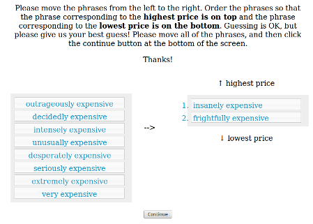

```{r echo=F}
### load required packages
library(lme4, quietly=T)
library(ggplot2, quietly=T)
library(plyr, quietly=T)
source("~/opt/r_helper_scripts/bootsSummary.r")
source("~/opt/r_helper_scripts/gg_themes.R")
gg_color_hue <- function(n) {
  hues = seq(15, 375, length=n+1)
  hcl(h=hues, l=65, c=100)[1:n]
}
```

We had 4 adjectives: expensive, beautiful, old, tall.

We had 4 sets of degree adverbs:

```{r echo=F}
### define different adjective sets
list_a = c(
  "surpassingly",
  "astoundingly",
  "fantastically",
  "strikingly",
  "excessively",
  "markedly",
  "remarkably",
  "utterly",
  "truly",
  "particularly"
)
list_b = c(
  "colossally",
  "phenomenally",
  "mightily",
  "acutely",
  "extraordinarily",
  "amazingly",
  "terribly",
  "notably",
  "significantly",
  "quite"
)
list_c = c(
  "terrifically",
  "uncommonly",
  "supremely",
  "awfully",
  "exceedingly",
  "radically",
  "exceptionally",
  "incredibly",
  "totally",
  "especially"
)
list_d = c(
  "frightfully",
  "outrageously",
  "insanely",
  "decidedly",
  "intensely",
  "unusually",
  "desperately",
  "seriously",
  "extremely",
  "very"
)
```

|    List A     |     List B       |     List C    |     List D    |
|:--------------|:-----------------|:--------------|:--------------|
| surpassingly  | colossally       | terrifically  | frightfully   |
| astoundingly  | phenomenally     | uncommonly    | outrageously  |
| fantastically | mightily         | supremely     | insanely      |
| strikingly    | acutely          | awfully       | decidedly     |
| excessively   | extraordinarily  | exceedingly   | intensely     |
| markedly      | amazingly        | radically     | unusually     |
| remarkably    | terribly         | exceptionally | desperately   |
| utterly       | notably          | incredibly    | seriously     |
| truly         | significantly    | totally       | extremely     |
| particularly  | quite            | especially    | very          |

For each adjective and list of degree adverbs, we asked participants to arrange adjective phrases in order from most to least strong.



```{r echo=F}
### load data
d = read.table("degree-adverbs-exp4.tsv", header=T, sep="\t")
d = d[,c("workerid", "trial", "adverb", "ranking", "asses")]
d$adjective_phrase = d$adverb
d$adverb = sapply(strsplit(as.character(d$adjective_phrase), " "), function(lst) {return(lst[[1]])})
d$adjective = sapply(strsplit(as.character(d$adjective_phrase), " "), function(lst) {return(lst[[2]])})
d$adverb_list = rep("A", nrow(d))
d$adverb_list[d$adverb %in% list_b] = "B"
d$adverb_list[d$adverb %in% list_c] = "C"
d$adverb_list[d$adverb %in% list_d] = "D"
ngrams = read.table("ngrams-exp4.csv", header=T, sep=",")
frequencies = ngrams$frequency
names(frequencies) = ngrams$ngram
syllables = ngrams$syllables
names(syllables) = ngrams$ngram
d$frequency = sapply(d$adverb, function(adverb) {return(frequencies[adverb])})
d$syllables = sapply(d$adverb, function(adverb) {return(syllables[adverb])})
total_1grams = 1024908267229
d$surprisal = log(total_1grams)-log(d$frequency)
 #d = ddply(d, .(workerid, adverb_list), transform, rank_order = rank(frequency))
```

```{r echo=F, fig.width=10, fig.height=6}
d$height_in_list = 1-d$ranking
#with(d, cor.test(ranking, rank_order), method = "spearman")
with(d[d$adverb_list == "A",], cor.test(surprisal, height_in_list))
with(d[d$adverb_list == "B",], cor.test(surprisal, height_in_list))
with(d[d$adverb_list == "C",], cor.test(surprisal, height_in_list))
with(d[d$adverb_list == "D",], cor.test(surprisal, height_in_list))

with(d[d$adverb_list == "A",], cor.test(syllables, height_in_list), method = "spearman")
with(d[d$adverb_list == "B",], cor.test(syllables, height_in_list), method = "spearman")
with(d[d$adverb_list == "C",], cor.test(syllables, height_in_list), method = "spearman")
with(d[d$adverb_list == "D",], cor.test(syllables, height_in_list), method = "spearman")

with(d, cor.test(surprisal, height_in_list), method="spearman")
with(d, cor.test(syllables, height_in_list), method="spearman")

d$height_in_list = 1-d$ranking
d$syllables = factor(syllables, ordered=T)
d_summary = bootsSummary(data=d, measurevar="height_in_list", groupvars=c("surprisal", "adverb", "adjective", "syllables"))
p = ggplot(d_summary, aes(x=surprisal, y=height_in_list, colour=syllables)) +
  geom_errorbar(aes(ymin=bootsci_low, ymax=bootsci_high, x=surprisal)) +
  geom_point() +
  geom_point(size=3) +
  theme_bw(18) +
  scale_colour_grey() +
  theme(panel.grid=element_blank()) +
  #geom_text(aes(label=adverb)) +
  geom_smooth(method="lm", se=T, colour="grey") +
  facet_wrap(~ adjective)
print(p)
ggsave("exp2-plot.png", width=10, height=6)

fit = lmer(height_in_list ~ adjective + (1 | workerid) + (1 | adverb_list) + (1 | surprisal) + (1 | syllables), data=d)
fit = lmer(height_in_list ~ surprisal + syllables +
             (1 + surprisal + syllables| workerid) +
             (1 + surprisal + syllables | adverb_list)), data=d)
print(summary(fit))
```
