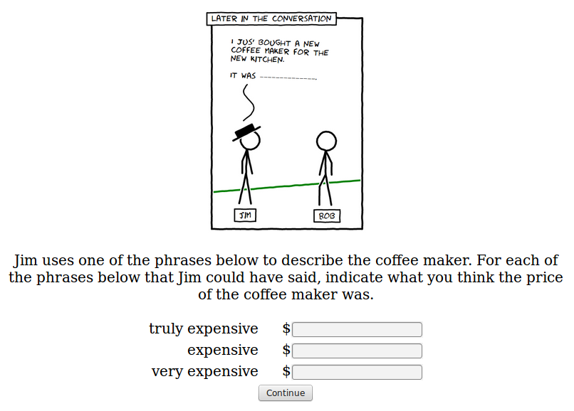

```{r echo=F}
### load required packages

library(lme4, quietly=T)
library(ggplot2, quietly=T)
library(plyr, quietly=T)
library(rjson, quietly=T)
source("~/opt/r_helper_scripts/bootsSummary.r")
source("~/opt/r_helper_scripts/gg_themes.R")
```

```{r echo=F}
### load data

d = read.table("exp8.tsv", header=T, sep="\t")
d$workerid = as.factor(d$workerid)
impatient_workers = unique(d$workerid[sapply(d$workerid, function(worker) {
  sum(as.logical(as.character(d$impatient[as.character(d$workerid) == worker])),
      na.rm=T) > 1
})])
d = d[!(d$workerid %in% impatient_workers) &
        !is.na(d$qtype) &
        d$qtype != "summary",]
d$target = d$Answer.target
d = d[,c("workerid", "word", "qtype", "response", "target")]
d$training_condition = d$target
d$response = as.numeric(as.character(d$response))

d_price = d[d$qtype == "price",]
d_price$logprice = log(d_price$response)
d_freq = d[d$qtype == "frequency",]

d_freq_vs_price = reshape(d[!(d$word %in% c("yep", "expensive", "bare")),],
                          direction="wide", timevar="qtype",
                          idvar=c("workerid", "word", "training_condition"))
d_freq_vs_price$logprice = log(d_freq_vs_price$response.price)
d_freq_vs_price$propto.surprisal = -log(d_freq_vs_price$response.frequency)

d_summary = bootsSummary(d_price, measurevar="response",
                         groupvars=c("training_condition", "word"))
d_freq = bootsSummary(d_freq, measurevar="response",
                         groupvars=c("training_condition", "word"))

# d$word = as.character(d$word)
# d$word[d$word == "bare"] = "other"
# d$word[d$word == "yep"] = "other"
# d$word[d$word == "expensive"] = "other"
d_price_diff = reshape(d_price[,c("workerid", "response", "training_condition", "word")],
                       direction="wide", timevar="word",
                       idvar=c("workerid", "training_condition"))
d_price_diff$diff.truly = d_price_diff$response.truly - d_price_diff$response.bare
d_price_diff$diff.very = d_price_diff$response.very - d_price_diff$response.bare
d_price_diff = d_price_diff[,c("workerid", "diff.truly", "diff.very", "training_condition")]
d_price_diff = reshape(d_price_diff,
                       direction="long", timevar="word",
                       varying=c("diff.truly", "diff.very"),
                       idvar=c("workerid", "training_condition"))

d_price_diff$frequency = mapply(function(word, workerid) {
  return(
    d$response[d$qtype == "frequency" &
                      as.character(d$workerid) == workerid &
                      d$word == word][1]
    )}, d_price_diff$word, as.character(d_price_diff$workerid))

d_diff_summary = bootsSummary(d_price_diff, measurevar="diff",
                         groupvars=c("training_condition", "word"))
```

I ran 20 participants on an experiment where I showed them comics where either the word "truly" or the word "very" was used **22 times** (that's twice as many times as in experiment 8a). The target question was:



I also asked how many times participants thought the speaker would use "truly" and "very".


This time the stories successfully manipulated participants' frequency estimates. Particpants give higher estimates for how often the speaker Jim will use a word if it is the target word (used 22 times in training) than if it is the control (used 0 times in training).

```{r echo=F, fig.width=10, fig.height=6}
dodge = position_dodge(width=0.9)
p = ggplot(data=d_freq, aes(x=word, y=response, colour=word)) +
  geom_bar(stat="identity") +
  geom_errorbar(aes(ymin=bootsci_low, ymax=bootsci_high, x=word), width=0.1) +
  facet_wrap(~ training_condition) +
  ggtitle("frequency estimates in different training conditions") +
  theme_black()
print(p)
```

In the raw data, this results (at least numerically) in the target word being assigned a less strong meaning.

```{r echo=F, fig.width=10, fig.height=6}
dodge = position_dodge(width=0.9)
p = ggplot(data=d_summary, aes(x=word, y=response, colour=training_condition)) +
  geom_bar(stat="identity", position=dodge) +
  geom_errorbar(aes(ymin=bootsci_low, ymax=bootsci_high, x=word),
                position=dodge, width=0.1) +
  ggtitle("prices in different training conditions") +
  theme_black()
print(p)
```

And when we recode the data in terms of difference scores (thus getting a lot of subject-by-subject variation) this effect is much clearer.

```{r echo=F, fig.width=10, fig.height=6}
dodge = position_dodge(width=0.9)
p = ggplot(data=d_diff_summary, aes(x=word, y=diff, colour=training_condition)) +
  geom_bar(stat="identity", position=dodge) +
  geom_errorbar(aes(ymin=bootsci_low, ymax=bootsci_high, x=word),
                position=dodge, width=0.1) +
  ggtitle("price diffs in different training conditions") +
  theme_black()
print(p)
```

Overall, there's a correlation of `r cor(-log(d_freq_vs_price$response.frequency), log(d_freq_vs_price$response.price))` between surprisal (calculated from participants' estmate of the frequency of the word) and the log of their price estimate.

```{r echo=F, fig.width=10, fig.height=6}
p = ggplot(data=d_freq_vs_price, aes(x=-log(response.frequency), y=log(response.price),
                            colour=training_condition)) +
  geom_point() +
  facet_wrap(~ word) +
  geom_smooth(method="lm", colour="white") +
  ggtitle("surprisal (from participants' frequency estimates) and log price") +
  theme_black()
print(p)
```