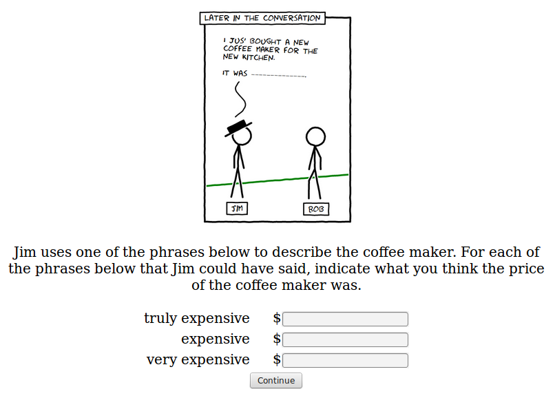
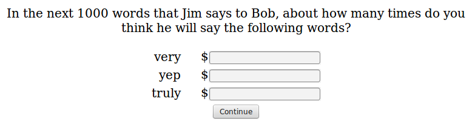

```{r echo=F}
### load required packages

library(lme4, quietly=T)
library(ggplot2, quietly=T)
library(plyr, quietly=T)
library(rjson, quietly=T)
source("~/opt/r_helper_scripts/bootsSummary.r")
source("~/opt/r_helper_scripts/gg_themes.R")
```

# Experiment 3

```{r echo=F}
### load data

cutquotes = function(s) {
  sl = unlist(strsplit(s, ""))
  sl = sl[2:(length(sl)-1)]
  return(paste(sl, collapse=""))
}

d = read.table("exp9.csv", header=T, sep=",")
d$workerid = as.factor(d$workerid)
total_workers = length(unique(d$workerid))
impatient_workers = unique(d$workerid[sapply(d$workerid, function(worker) {
  sum(as.logical(as.character(d$impatient[as.character(d$workerid) == worker])),
      na.rm=T) > 1
})])
d = d[!(d$workerid %in% impatient_workers) &
        !is.na(d$qtype) &
        d$qtype != "summary",]
total_good_workers = length(unique(d$workerid))
d$target = sapply(as.character(d$Answer.target), cutquotes)
d$dialect = d$Answer.dialect
d = d[,c("workerid", "word", "qtype", "response", "target", "word_type", "dialect")]
d$training_condition = d$target
d$response = as.numeric(as.character(d$response))

d_price = d[d$qtype == "price",]
d_price$logprice = log(d_price$response)
d_freq = d[d$qtype == "frequency",]

d_freq_vs_price = reshape(d[!(d$word %in% c("tree", "expensive", "bare")) & d$qtype %in% c("frequency", "price"),c("workerid", "word", "word_type", "target", "dialect", "training_condition", "response", "qtype")],
                          direction="wide", timevar="qtype",
                          idvar=c("workerid", "word", "word_type", "training_condition", "target", "dialect"))
d_freq_vs_price$logprice = log(d_freq_vs_price$response.price)
d_freq_vs_price$propto.surprisal = -log(d_freq_vs_price$response.frequency)

d_summary = bootsSummary(d_price, measurevar="response",
                         groupvars=c("training_condition", "word", "dialect"))
d_freq = bootsSummary(d_freq, measurevar="response",
                         groupvars=c("training_condition", "word", "dialect"))

# d$word = as.character(d$word)
# d$word[d$word == "bare"] = "other"
# d$word[d$word == "yep"] = "other"
# d$word[d$word == "expensive"] = "other"
d_price_diff = reshape(d_price[,c("workerid", "response", "training_condition", "word", "dialect")],
                       direction="wide", timevar="word",
                       idvar=c("workerid", "training_condition", "dialect"))
d_price_diff$diff.truly = d_price_diff$response.truly - d_price_diff$response.bare
d_price_diff$diff.very = d_price_diff$response.very - d_price_diff$response.bare
d_price_diff = d_price_diff[,c("workerid", "diff.truly", "diff.very", "training_condition", "dialect")]
d_price_diff = reshape(d_price_diff,
                       direction="long", timevar="word",
                       varying=c("diff.truly", "diff.very"),
                       idvar=c("workerid", "training_condition", "dialect"))

d_price_diff$frequency = mapply(function(word, workerid) {
  return(
    d$response[d$qtype == "frequency" &
                      as.character(d$workerid) == workerid &
                      d$word == word][1]
    )}, d_price_diff$word, as.character(d_price_diff$workerid))

d_price_diff$word_type = rep("control", nrow(d_price_diff))
d_price_diff$word_type[as.character(d_price_diff$word) == as.character(d_price_diff$training_condition)] = "target"
d_diff_summary = bootsSummary(d_price_diff, measurevar="diff",
                         groupvars=c("training_condition", "word", "dialect", "word_type"))
d_diff_summary_type = bootsSummary(d_price_diff, measurevar="diff",
                         groupvars=c("word_type", "word", "dialect"))
```

There were `r total_workers` participants. `r total_good_workers` of them passed attention checks.

Frequency estimates for an adverb were significantly higher when that adverb was the target (repeated) adverb.

```{r}
fit = lmer(response ~ word_type + (1 | word) + (1 | workerid), data=d[d$qtype == "frequency" & d$word_type != "tree",])
print(summary(fit))

d_freq_summary = bootsSummary(d[d$qtype == "frequency" & d$word_type != "tree",], measurevar="response",
                         groupvars=c("word_type", "word"))
dodge = position_dodge(width=0.9)
p = ggplot(data=d_freq_summary, aes(x=word_type, y=response, fill=word_type)) +
  geom_bar(stat="identity", position=dodge) +
  geom_errorbar(aes(ymin=bootsci_low, ymax=bootsci_high, x=word_type),
                position=dodge, width=0.1) +
  theme_bw(18) +
  facet_wrap( ~ word) +
  xlab("word type") +
  ylab("frequency estimate") +
  theme(panel.grid=element_blank()) +
  scale_fill_grey() +
  ggtitle("frequency estimates in different training conditions")
print(p)
#ggsave("images/exp3-freq-plot.png", width=10, height=6)

# p = ggplot(data=d_freq_summary, aes(x=word_type, y=response, fill=word_type)) +
#   geom_bar(stat="identity", position=dodge) +
#   geom_errorbar(aes(ymin=bootsci_low, ymax=bootsci_high, x=word_type),
#                 position=dodge, width=0.1, colour="white") +
#   facet_grid(dialect ~ word) +
#   xlab("word type") +
#   ylab("frequency estimate") +
#   theme_blackDisplay()
# print(p)
# #ggsave("images/exp3-freq-plot-presentation.png", width=10, height=6)
```

Without any dialect markers, people thought Jim's way of speaking was pretty usual. With dialect markers, participants thought his way of speaking was more unusual.

```{r}
# fit = lmer(diff ~ word_type + (1 | word) + (1 | workerid), data=d_price_diff)
# print(summary(fit))

dodge = position_dodge(width=0.9)
d_dialect = d[d$qtype == "dialect",]
d_dialect$response = as.numeric(as.character(d_dialect$response)) + 2
d_dialect_summary = bootsSummary(data=d_dialect, measurevar="response", groupvars=c("dialect", "word"))
p = ggplot(d_dialect_summary, aes(x=dialect, y=response, fill=word)) +
  geom_bar(stat="identity", position=dodge) +
  geom_errorbar(aes(ymin=bootsci_low, ymax=bootsci_high, x=dialect),
                position=dodge, width=0.1) +
  theme_bw(18) +
  xlab("dialect condition") +
  ylab("<--less usual                     more usual-->") +
  ggtitle("Judgments of how 'usual' Jim's speech is") +
  theme(panel.grid=element_blank()) +
  scale_fill_grey()
print(p)
#ggsave("images/exp3-price-plot.png", width=10, height=6)
```

Without any dialect markers, people thought Jim's way of speaking was pretty usual. With dialect markers, participants thought his way of speaking was more unusual.

```{r}
## this was incorrectly logged for first 88 Ss
dodge = position_dodge(width=0.9)
d[d$qtype %in% c("excitable", "dialect") & as.numeric(as.character(d$workerid)) > 87,]
d_dialect = d[d$qtype == "excitable" & as.numeric(as.character(d$workerid)) > 87 & !is.na(d$response),]
d_dialect$response = as.numeric(as.character(d_dialect$response))
d_dialect_summary = bootsSummary(data=d_dialect, measurevar="response", groupvars=c("dialect", "word"))
p = ggplot(d_dialect_summary, aes(x=dialect, y=response, fill=word)) +
  geom_bar(stat="identity", position=dodge) +
  geom_errorbar(aes(ymin=bootsci_low, ymax=bootsci_high, x=dialect),
                position=dodge, width=0.1) +
  theme_bw(18) +
  geom_text(aes(label=N, y=-0.1)) +
  xlab("dialect condition") +
  ylab("<--less excitable                     more excitable-->") +
  ggtitle("Judgments of how excitable Jim is") +
  theme(panel.grid=element_blank()) +
  scale_fill_grey()
print(p)
#ggsave("images/exp3-price-plot.png", width=10, height=6)
```

When the speaker was speaking "normal" English, price estimates were significantly lower when the adverb was the target adverb.

```{r}
# fit = lmer(diff ~ word_type + (1 | word) + (1 | workerid), data=d_price_diff)
# print(summary(fit))

dodge = position_dodge(width=0.9)
p = ggplot(data=d_diff_summary_type, aes(x=word_type, y=diff, fill=word_type)) +
  geom_bar(stat="identity", position=dodge) +
  geom_errorbar(aes(ymin=bootsci_low, ymax=bootsci_high, x=word_type),
                position=dodge, width=0.1) +
  theme_bw(18) +
  facet_grid(dialect ~ word) +
  geom_text(aes(label=N, y=-30)) +
  xlab("word type") +
  ylab("difference between target and bare price estimates") +
  theme(panel.grid=element_blank()) +
  scale_fill_grey() +
  ggtitle("difference score of prices in different training conditions")
print(p)
#ggsave("images/exp3-price-plot.png", width=10, height=6)

p = ggplot(data=d_diff_summary_type[d_diff_summary_type$dialect == '"other"',], aes(x=word_type, y=diff, fill=word_type)) +
  geom_bar(stat="identity", position=dodge) +
  geom_errorbar(aes(ymin=bootsci_low, ymax=bootsci_high, x=word_type),
                position=dodge, width=0.1, colour="white") +
  #facet_grid(dialect ~ word) +
  facet_wrap( ~ word) +
  xlab("word type") +
  ylab("difference between target and bare price estimates") +
  theme_black()
print(p)
#ggsave("images/exp3-price-plot-presentation.png", width=10, height=6)
```

Price estimates correlated with frequency estimates.

```{r}

fit = lm(response.price ~ response.frequency, data=d_freq_vs_price)
print(summary(fit))

p = ggplot(data=d_freq_vs_price[d_freq_vs_price$response.frequency != 0,], aes(x=-log(response.frequency), y=log(response.price), colour=word_type)) +
  geom_point(size=3, alpha=1/2) +
  theme_bw(18) +
  geom_smooth(method="lm") +
  xlab("-log(frequency estimate)") +
  ylab("logprice") +
  facet_wrap("dialect") +
  theme(panel.grid=element_blank())
print(p)

# fit = lm(response.price ~ response.frequency, data=d_freq_vs_price)
# print(summary(fit))
# p = ggplot(data=d_freq_vs_price, aes(x=-log(response.frequency), y=log(response.price))) +
#   geom_point(size=3, colour="white") +
#   geom_smooth(method="lm", colour="grey") +
#   theme_blackDisplay() +
#   xlab("-log(frequency)") +
#   ylab("logprice")
# 
# 
# with(d_freq_vs_price, cor.test(-log(response.frequency), log(response.price)), method="pearson")
```


```{r echo=F}
### load data

d = read.table("exp9.csv", header=T, sep=",")
ntotal_workers = length(unique(d$workerid))
d$workerid = as.factor(d$workerid)
impatient_workers = unique(d$workerid[sapply(d$workerid, function(worker) {
  sum(as.logical(as.character(d$impatient[as.character(d$workerid) == worker])),
      na.rm=T) > 1
})])
d = d[!(d$workerid %in% impatient_workers) &
        !is.na(d$qtype) &
        d$qtype != "summary",]
ngood_workers = length(unique(d$workerid))
d$target = d$Answer.target
d$dialect = d$Answer.dialect
d = d[,c("workerid", "word", "qtype", "response", "target", "dialect")]
d$training_condition = d$target
d$response = as.numeric(as.character(d$response))

d_price = d[d$qtype == "price",]
d_price$logprice = log(d_price$response)
d_freq = d[d$qtype == "frequency",]

d_freq_vs_price = reshape(d[!(d$word %in% c("tree", "expensive", "bare")),],
                          direction="wide", timevar="qtype",
                          idvar=c("workerid", "word", "training_condition"))
d_freq_vs_price$logprice = log(d_freq_vs_price$response.price)
d_freq_vs_price$propto.surprisal = -log(d_freq_vs_price$response.frequency)

d_summary = bootsSummary(d_price, measurevar="response",
                         groupvars=c("training_condition", "word"))
d_freq = bootsSummary(d_freq, measurevar="response",
                         groupvars=c("training_condition", "word"))

# d$word = as.character(d$word)
# d$word[d$word == "bare"] = "other"
# d$word[d$word == "yep"] = "other"
# d$word[d$word == "expensive"] = "other"
d_price_diff = reshape(d_price[,c("workerid", "response", "training_condition", "word")],
                       direction="wide", timevar="word",
                       idvar=c("workerid", "training_condition"))
d_price_diff$diff.truly = d_price_diff$response.truly - d_price_diff$response.bare
d_price_diff$diff.very = d_price_diff$response.very - d_price_diff$response.bare
d_price_diff = d_price_diff[,c("workerid", "diff.truly", "diff.very", "training_condition")]
d_price_diff = reshape(d_price_diff,
                       direction="long", timevar="word",
                       varying=c("diff.truly", "diff.very"),
                       idvar=c("workerid", "training_condition"))

d_price_diff$frequency = mapply(function(word, workerid) {
  return(
    d$response[d$qtype == "frequency" &
                      as.character(d$workerid) == workerid &
                      d$word == word][1]
    )}, d_price_diff$word, as.character(d_price_diff$workerid))

d_diff_summary = bootsSummary(d_price_diff, measurevar="diff",
                         groupvars=c("training_condition", "word"))
```

```{r}
p = ggplot(data=d_freq_summary, aes(x=word_type, y=response, fill=word_type)) +
  geom_bar(stat="identity", position=dodge) +
  geom_errorbar(aes(ymin=bootsci_low, ymax=bootsci_high, x=word_type),
                position=dodge, width=0.1, colour="white") +
  facet_wrap(~ word) +
  xlab("word type") +
  ylab("frequency estimate") +
  theme_blackDisplay()
ggsave("images/exp3-freq-plot-presentation.png", width=10, height=6)
```

I ran 20 participants on an experiment where I showed them comics where either the word "truly" or the word "very" was used **22 times** (that's twice as many times as in experiment 8a). The target question was:



I also asked how many times participants thought the speaker would use "truly" and "very".



This time the stories successfully manipulated participants' frequency estimates. Particpants give higher estimates for how often the speaker Jim will use a word if it is the target word (used 22 times in training) than if it is the control (used 0 times in training).

```{r echo=F, fig.width=10, fig.height=6}
dodge = position_dodge(width=0.9)
p = ggplot(data=d_freq, aes(x=word, y=response, colour=word)) +
  geom_bar(stat="identity") +
  geom_errorbar(aes(ymin=bootsci_low, ymax=bootsci_high, x=word), width=0.1) +
  facet_wrap(~ training_condition) +
  ggtitle("frequency estimates in different training conditions") +
  theme_black()
print(p)
```

In the raw data, this results (at least numerically) in the target word being assigned a less strong meaning.

```{r echo=F, fig.width=10, fig.height=6}
dodge = position_dodge(width=0.9)
p = ggplot(data=d_summary, aes(x=word, y=response, colour=training_condition)) +
  geom_bar(stat="identity", position=dodge) +
  geom_errorbar(aes(ymin=bootsci_low, ymax=bootsci_high, x=word),
                position=dodge, width=0.1) +
  ggtitle("prices in different training conditions") +
  theme_black()
print(p)
```

And when we recode the data in terms of difference scores (thus getting a lot of subject-by-subject variation) this effect is much clearer.

```{r echo=F, fig.width=10, fig.height=6}
dodge = position_dodge(width=0.9)
p = ggplot(data=d_diff_summary, aes(x=word, y=diff, colour=training_condition)) +
  geom_bar(stat="identity", position=dodge) +
  geom_errorbar(aes(ymin=bootsci_low, ymax=bootsci_high, x=word),
                position=dodge, width=0.1) +
  ggtitle("price diffs in different training conditions") +
  theme_black()
print(p)
```

Overall, there's a correlation of `r cor(-log(d_freq_vs_price$response.frequency), log(d_freq_vs_price$response.price))` between surprisal (calculated from participants' estmate of the frequency of the word) and the log of their price estimate.

```{r echo=F, fig.width=10, fig.height=6}
p = ggplot(data=d_freq_vs_price, aes(x=-log(response.frequency), y=log(response.price),
                            colour=training_condition)) +
  geom_point() +
  facet_wrap(~ word) +
  geom_smooth(method="lm", colour="white") +
  ggtitle("surprisal (from participants' frequency estimates) and log price") +
  theme_black()
print(p)
```